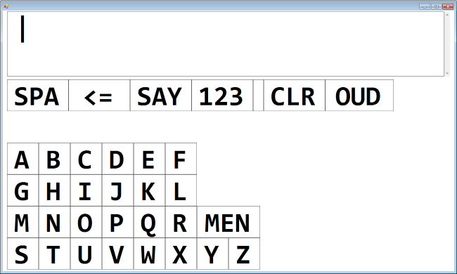
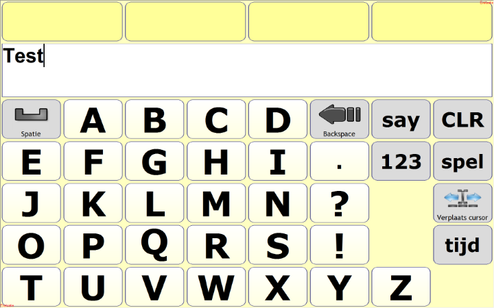

# KiepCommunication
### The first communication tools we created for Kiep
 
Features of KiepCommunication:
 - C# Windows Forms application
 - Using 1 button scanning input method
 - Control with numpad 
 - Text to speech
 - Autocompletion
 - Speak "yes" and "no" .WAV files via numpad
 

---

The Tobii page set is derived from a standard Tobii Communicator page set and optimized.

See [KiepProjects](https://github.com/Joozt/KiepProjects) for an overview of all Kiep projects.
